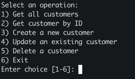

# Customer CRUD Application

## Pre-requisties
1. Have docker installed. [Get Docker](https://docs.docker.com/get-started/get-docker/)
2. Clone the customers application.
```
$ git clone git@github.com:bingi2808/customers.git
```


## Run the application
1. Go to the application folder.
2. Run the application using the docker-compose command.
``` 
$ docker-compose up -d 
```
2. Application should be up and running in 8080 once containers are up.
3. Use the customer_api.sh script to make api calls to the service.
```
$ ./customer_api.sh
# Note: This script requires jq dependency.
# $ brew install jq
```
4. Once the script starts, a prompt will made to choose which api call to make. Screenshot added for reference.


5. To view the logs
```
# Application Logs
$ docker exec -it customer_app_container tail -f  /var/logs/

# Access Logs (Note: change the date to view the specific day file)
$ docker exec -it customer_app tail -f /tomcat/logs/access_log.2025-02-18.log
```

## Run the application for local development
### Pre-requisite: Run MySQL server using docker image
This application uses external database MySQL. Install docker image for MySQL 9.2 and run in port 3306 by using the following steps.
```
$ docker pull mysql:9.2
$ docker run --name customers-mysql -e MYSQL_ROOT_PASSWORD=password -d mysql
$ docker exec -it customers-mysql bash
$ mysql -u root -p
$ CREATE DATABASE customer_db;
```
### Run the customers application
1. Using command line to run the application. 
```
$ ./gradlew build
$ java -jar build/libs/customers-1.0.0.jar #Update the jar version by referring from build.gradle file.
```
2. Open project in an IDE and run the CustomersApplication.java class.

## Run the tests
```
$ ./gradlew test
```

